# 拼CC-自由拼单平台
> 特别感谢 harry0071 的“轻贴吧”项目，为我们提供了极大的帮助。
## 用途
用户在登陆之后，可以自由发布拼单信息。总共分为拼车、拼外卖、拼会员三种类型。
## 界面浏览
### 主页：
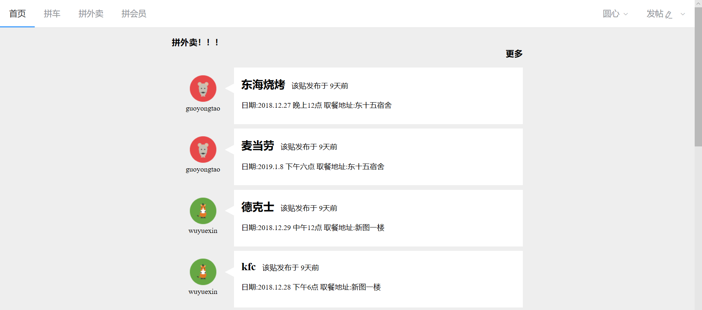
### 登陆与注册：
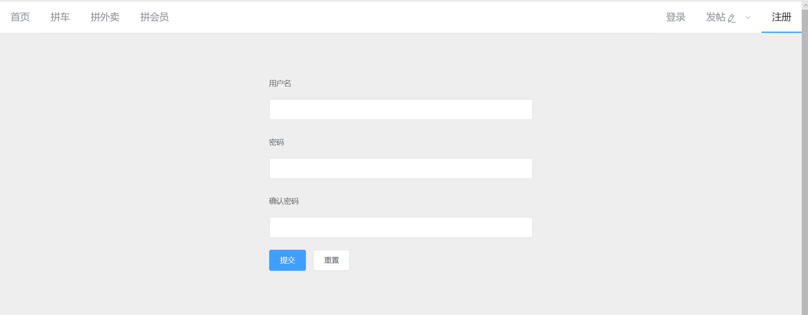
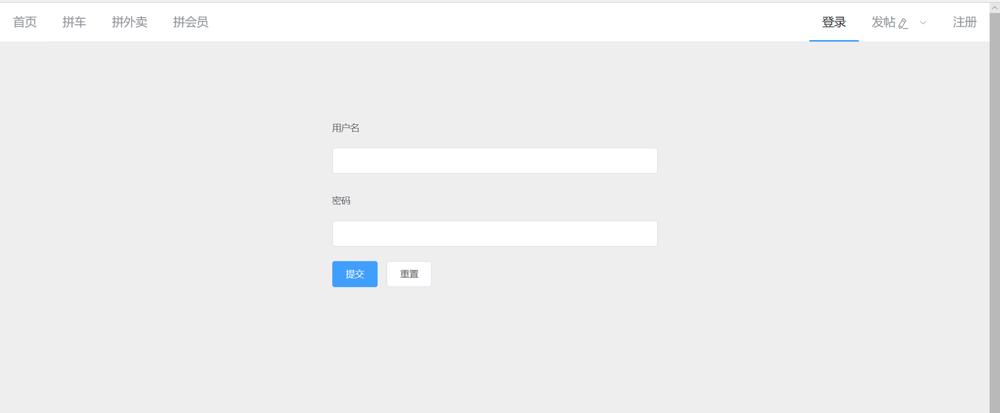
### 发帖界面：
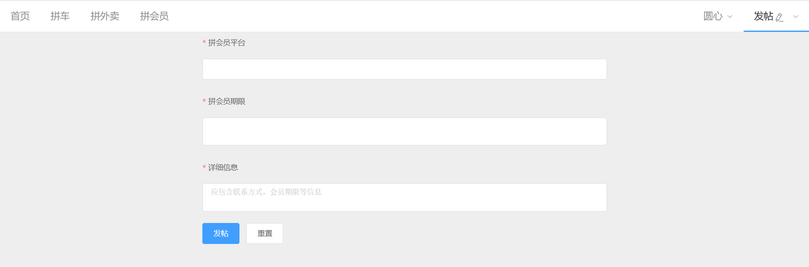
### 信息详情：
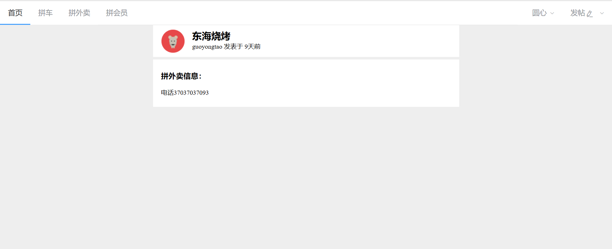
### 个人信息:
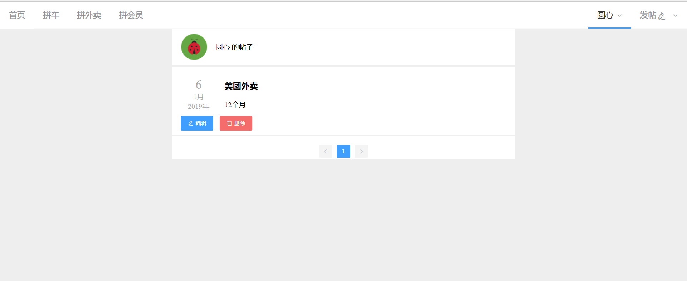
---
## q1 analysis
### 问题1、2
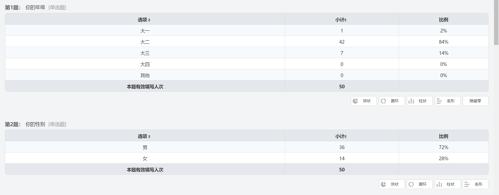
本次调查主体是大学生，大二年级学生居多，男性居多
### 问题3
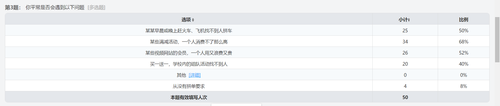
该问题旨在于调查大学生在日常生活中是否有拼单的需求，调查结果显示90%以上的人都曾有过拼单的需求
### 问题4
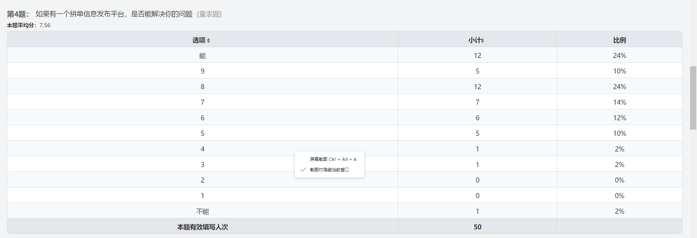
该问题平均得分为7.56，这一平台还是能满足大部分人的需求
### 问题5
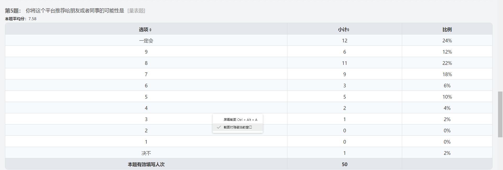
净推荐值为7.58
### 问题6
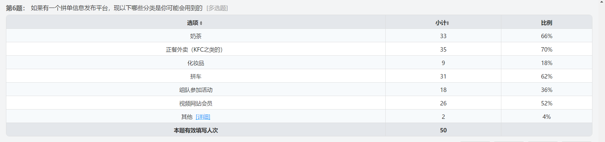
该问题调查哪些需求市场最大，根据结果我们初步选择了食品，会员，拼车三方面
### 问题7，8
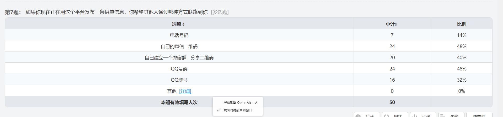
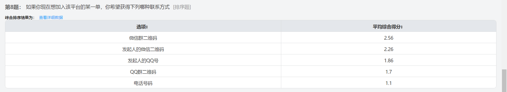
前期我们想初步调查拼单发起人相互联系的方式，各种形式都有人选择，最终方案待定。

## Analysis for Questionaire 2
### 问题1，2
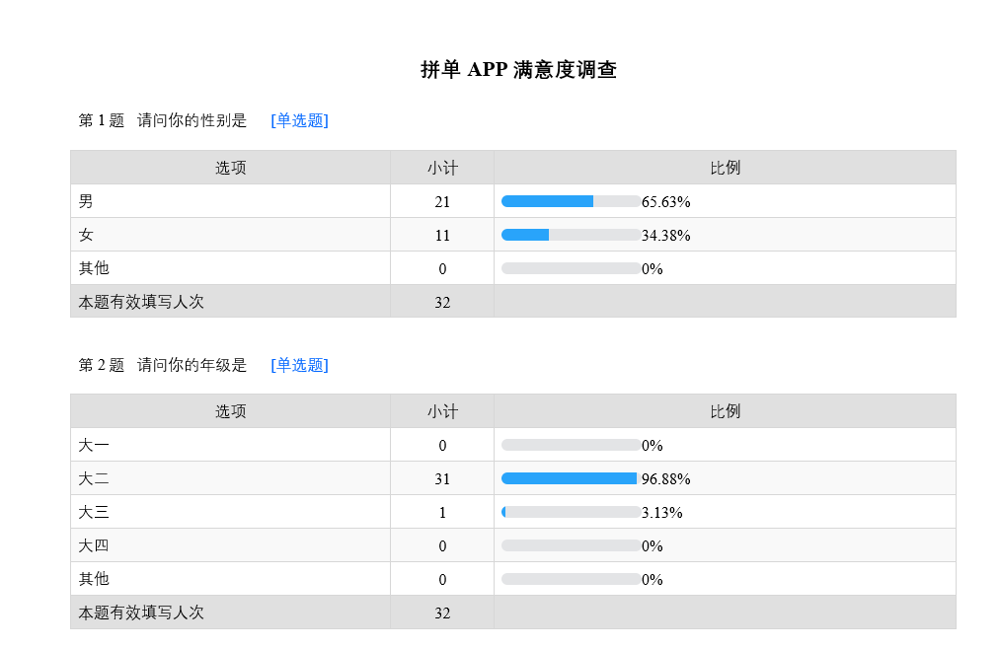
本次调查样本主要为大二学生，男性居多

### 问题3到11每三个针对我们已经实现的功能进行调查
### 问题3，4，5
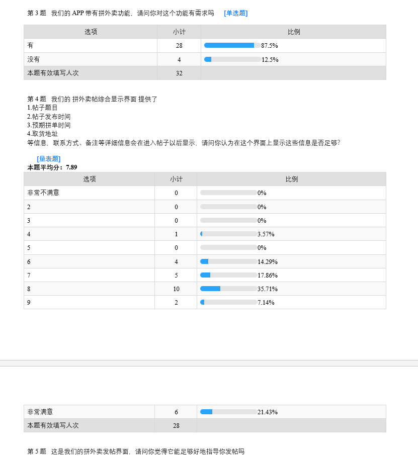
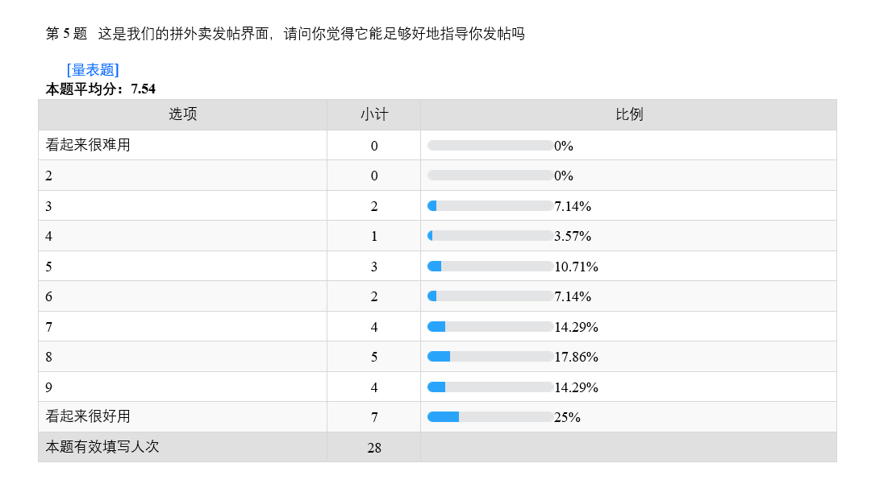
87.5%的人有外卖拼单的需求，这是三个功能中最多的。对界面的满意度为7.89,7,54，说明还有改进空间。

### 问题6，7，8
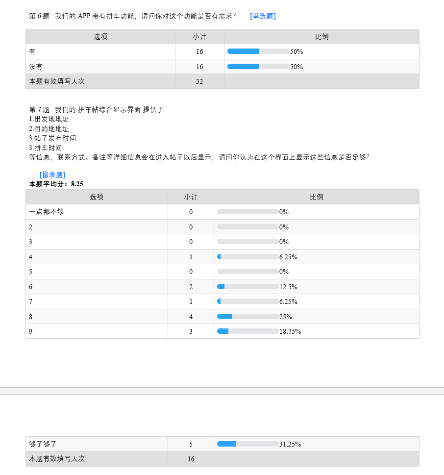
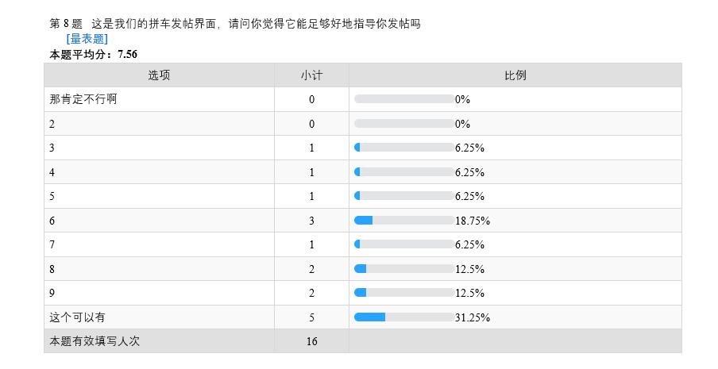
对拼车有需求的人只有50%,这是三个功能中最少的。对界面的满意度为8.25,7.56，略好过拼外卖部分。

### 问题9,10,11
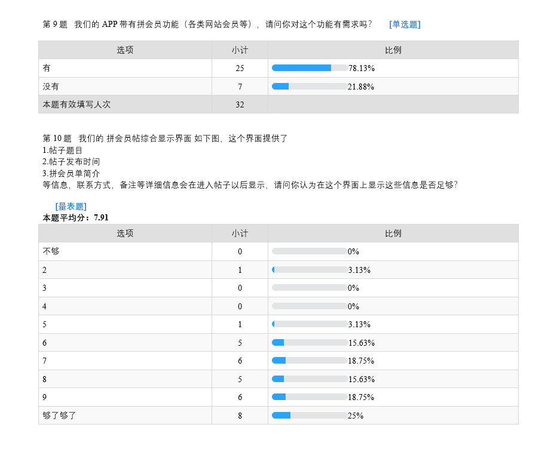
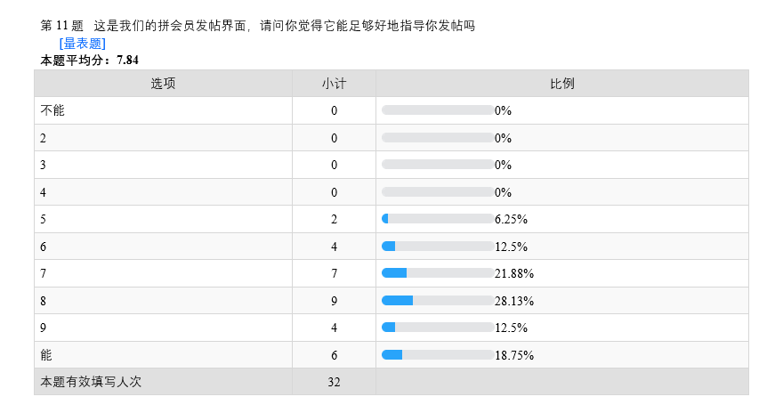
对网站会员的拼单有需求的人占78.13%，三个功能中居中。对界面的满意度为7.91,7.84，总的来说界面尚不能完全让样本满意。

### 问题12-14针对我们打算加入的功能进行了提问
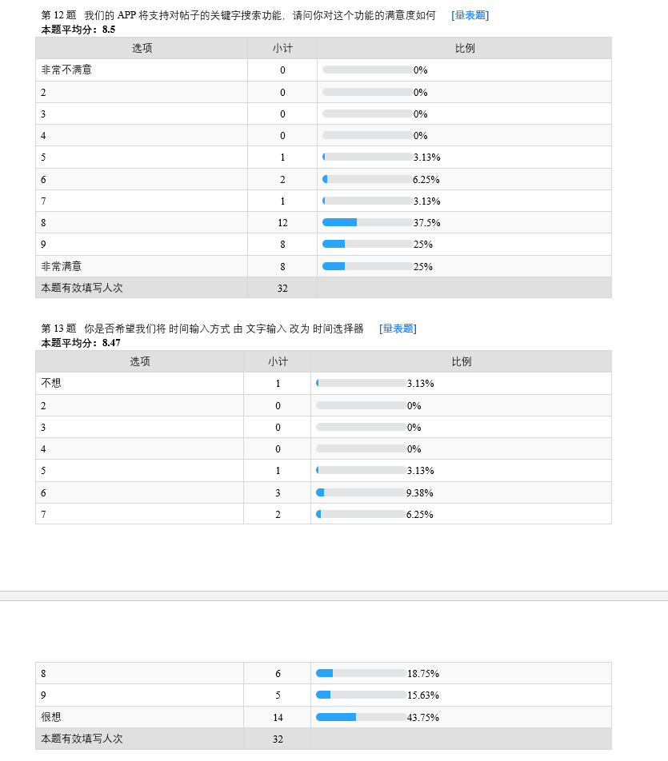
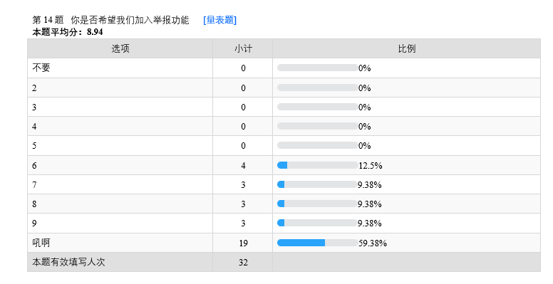
举报功能是受最多推选的功能，三个功能的得分都相对较高。
